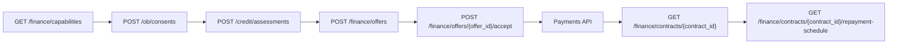

# Credit & Finance API

The Credit & Finance API defines how a regulated lender, fintech, bank, or gateway turns customer-permissioned Open Banking data into a financed-payment offer. It supports BNPL installments, revolving-credit drawdowns, and Murabaha-style installment finance without making OpenWave the lender or the credit bureau.

## OpenAPI

<div class="ow-dl-row">
  <a class="ow-dl-btn" href="https://raw.githubusercontent.com/neptune-ly/openwave-spec/main/openwave-credit-finance-v1.yaml" download>Download YAML</a>
  <a class="ow-dl-btn-ghost" href="https://editor.swagger.io/?url=https://raw.githubusercontent.com/neptune-ly/openwave-spec/main/openwave-credit-finance-v1.yaml" target="_blank">Open in Swagger Editor</a>
  <a class="ow-dl-btn-ghost" href="../downloads.html">Client tools</a>
</div>

## Main flows

| Step | Endpoint | Caller | Purpose |
|---:|---|---|---|
| 1 | `POST /ob/consents` | TPP or finance provider | Request credit-specific scopes and purpose-bound customer consent. |
| 2 | `POST /credit/assessments` | Finance provider | Build an affordability and risk package from consented data. |
| 3 | `POST /finance/offers` | Finance provider or gateway | Create BNPL, revolving, or Murabaha offer. |
| 4 | `POST /finance/offers/{offer_id}/accept` | Hosted customer surface | Customer accepts terms, disclosure, schedule, and repayment mandate. |
| 5 | Normal Payments API | Lender or gateway | Financier pays merchant; merchant fulfils after final payment confirmation. |
| 6 | `GET /finance/contracts/{contract_id}/repayment-schedule` | Customer or provider | Show upcoming installments and repayment status. |



## Key endpoints

| Method | Path | Description |
|---|---|---|
| `GET` | `/finance/capabilities` | Discover supported finance products, scopes, and repayment support. |
| `POST` | `/credit/assessments` | Create a purpose-bound affordability and risk assessment. |
| `GET` | `/credit/assessments/{assessment_id}` | Read assessment status and output. |
| `POST` | `/credit/assessments/{assessment_id}/refresh` | Refresh while consent is still active. |
| `DELETE` | `/credit/assessments/{assessment_id}` | Revoke or delete retained assessment output. |
| `POST` | `/finance/offers` | Create financed checkout offer. |
| `GET` | `/finance/offers/{offer_id}` | Read offer terms and disclosure link. |
| `POST` | `/finance/offers/{offer_id}/accept` | Accept offer from hosted or official SDK customer surface. |
| `GET` | `/finance/contracts/{contract_id}` | Read active contract state. |
| `GET` | `/finance/contracts/{contract_id}/repayment-schedule` | Read repayment schedule. |
| `POST` | `/finance/contracts/{contract_id}/cancel` | Cancel where policy allows. |

## Product types

| Product | Use case | Required customer disclosure |
|---|---|---|
| `BNPL_INSTALLMENT` | Split a merchant purchase into fixed installments. | Amount financed, installment amount, due dates, fees/charges, cancellation policy. |
| `REVOLVING_CREDIT_DRAW` | Draw against an existing approved facility. | Facility, draw amount, repayment method, cost, available balance impact. |
| `MURABAHA_INSTALLMENT` | Asset sale with disclosed profit and installment schedule. | Asset description, cash price, profit amount, total sale price, down payment, installments, contract/disclosure URL. |

## Example assessment result

```json
{
  "assessment_id": "cas_01JCR68Q7J8NTXKTJBK3EWY44P",
  "status": "COMPLETED",
  "purpose": "BNPL",
  "requested_amount": 860000,
  "currency": "LYD",
  "income_summary": {
    "monthly_average_income": 2600000,
    "income_confidence": "HIGH",
    "detected_salary_frequency": "MONTHLY",
    "currency": "LYD"
  },
  "debt_service_indicators": {
    "existing_debt_service_ratio_bps": 1800,
    "proposed_debt_service_ratio_bps": 2350,
    "disposable_income_after_obligations": 1230000,
    "currency": "LYD"
  },
  "affordability": {
    "result": "AFFORDABLE",
    "maximum_affordable_installment": 420000,
    "currency": "LYD"
  },
  "risk_score": {
    "score": 692,
    "scale_min": 300,
    "scale_max": 900,
    "band": "MEDIUM_LOW_RISK",
    "model_id": "provider-model-v1",
    "model_version": "2026-05"
  },
  "reason_codes": [
    {
      "code": "STABLE_INCOME",
      "category": "POSITIVE",
      "message": "Recurring income pattern detected."
    }
  ],
  "correlation_id": "corr_01JCR6A2CC4VB7CWD0TR7B7Z3A"
}
```

## Webhook events

| Event | When it fires |
|---|---|
| `credit_assessment.completed` | Assessment output is ready. |
| `finance_offer.created` | Offer has been created and is ready for customer review. |
| `finance_offer.accepted` | Customer accepted terms in a secure surface. |
| `finance_contract.active` | Financing is active and merchant payment can complete. |
| `finance_contract.cancelled` | Contract was cancelled under allowed rules. |
| `repayment.completed` | Scheduled repayment collected. |
| `repayment.failed` | Scheduled repayment failed or was rejected. |

## Related guides

- [Credit & Finance overview](../guide/credit-finance.md)
- [Credit-assessment consent](../guide/credit-assessment-consent.md)
- [BNPL flow](../guide/bnpl.md)
- [Revolving credit flow](../guide/revolving-credit.md)
- [Murabaha flow](../guide/murabaha.md)
- [Financed-payment lifecycle](../guide/financed-payment-lifecycle.md)
- [Risk, privacy, and explainability](../guide/risk-privacy-explainability.md)
