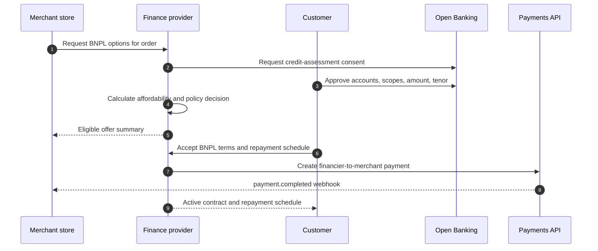
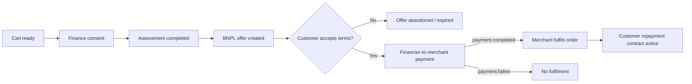

# BNPL Flow

BNPL in OpenWave is a financed checkout product. The merchant does not lend money directly and does not see the customer’s raw account history. The finance provider assesses the customer, creates an offer, and pays the merchant after customer acceptance.

## Flow

## BNPL state handoff

BNPL has two approvals: finance eligibility and final merchant payment. A merchant should not fulfil until the payment rail confirms the financed payment.

## Customer and merchant view

| Step | Customer sees | Merchant sees |
|---|---|---|
| Consent | Why data is needed, selected accounts, amount, tenor. | Finance flow started. |
| Assessment | Eligibility status where policy permits. | Merchant-safe eligible, declined, or review status. |
| Offer | Installment amounts, dates, cost, disclosure URL. | Offer created, no raw account facts. |
| Acceptance | Hosted or SDK confirmation. | Pending financed payment. |
| Settlement | Order paid by financier. | Signed `payment.completed` webhook. |
| Repayment | Contract and schedule. | No repayment servicing details unless needed for merchant policy. |

## Required offer fields

| Field | Description |
|---|---|
| `product_type` | `BNPL_INSTALLMENT` |
| `amount` and `currency` | Financed purchase amount in minor units. |
| `tenor` | Number of weeks or months. |
| `finance_cost` | Fees, interest, charges, or zero-cost disclosure. |
| `repayment_schedule_preview` | Due dates and installment amounts before acceptance. |
| `disclosure_url` | Customer-readable terms. |
| `accept_url` | Hosted or official SDK customer acceptance surface. |

## Merchant fulfilment rule

The merchant fulfils only after final financed-payment confirmation:

1. Customer accepts BNPL offer.
2. Finance contract becomes active or pending settlement.
3. Financier pays merchant through OpenWave Payments.
4. Merchant receives and verifies `payment.completed`.
5. Merchant fulfils the order.

Do not fulfil on assessment approval alone. Assessment approval is not settlement.

## Safe decline output

Declines should be explainable but not expose sensitive bank facts to merchants:

| Reason code | Safe merchant message |
|---|---|
| `INSUFFICIENT_INCOME_HISTORY` | Unable to verify enough history for this finance request. |
| `HIGH_OBLIGATION_RATIO` | The request does not meet affordability policy. |
| `REQUESTED_AMOUNT_TOO_HIGH` | The requested amount is above the eligible limit. |
| `MANUAL_REVIEW_REQUIRED` | The request needs manual review before an offer can be issued. |
