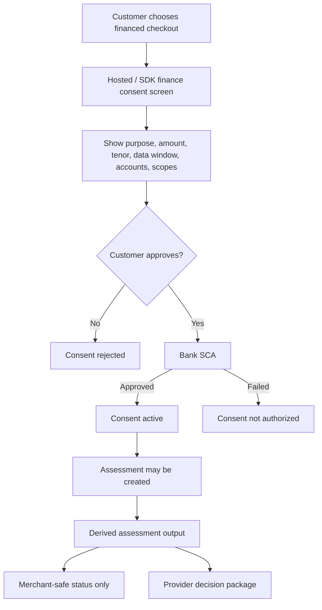
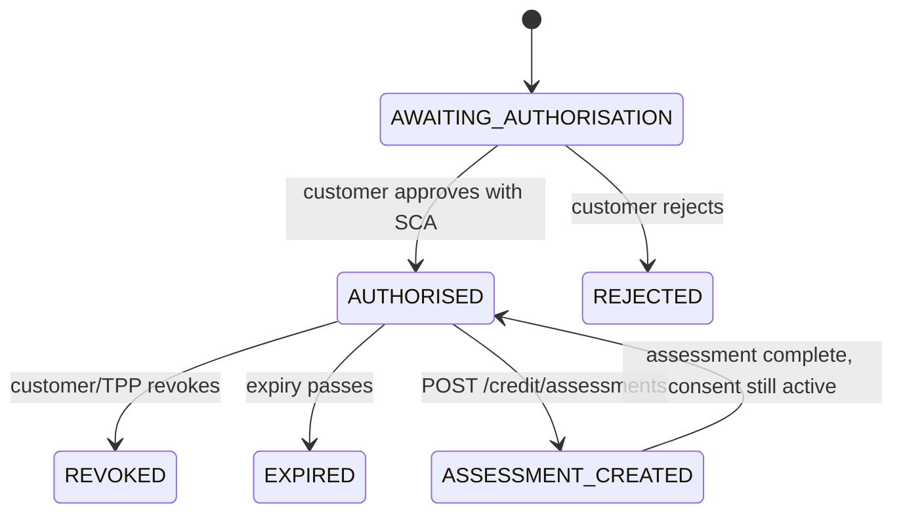
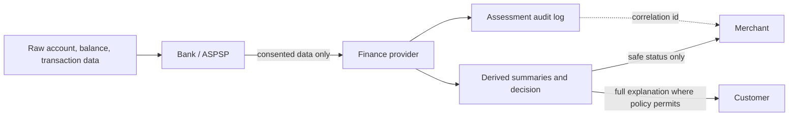

# Credit-Assessment Consent

Credit assessment consent is a high-sensitivity Open Banking consent. It must be explicit, purpose-bound, time-bound, and revocable.

## Consent must look like finance consent

The customer must understand that account data will be used for a finance eligibility decision, not just for generic account display.



## Consent page checklist

| Screen area | Required content | Good customer wording |
|---|---|---|
| Purpose | Why data is requested. | "Use my bank data to check eligibility for this financed purchase." |
| Amount and tenor | Requested value and repayment duration. | "860.000 LYD over 6 months." |
| Data access | Account types, balances, transactions, income, liabilities, affordability. | "Only selected accounts for the shown date range." |
| Recipient | The party receiving derived assessment output. | "Finance provider receives eligibility result and reason codes." |
| Merchant boundary | What the merchant can see. | "The merchant does not see your transactions." |
| Revocation | How consent can be revoked. | "You can revoke this permission from your banking or OpenWave portal." |

## Required customer disclosure

The hosted consent screen must show:

| Field | Why it matters |
|---|---|
| Finance purpose | Customer must know this is for eligibility, affordability, or financed checkout. |
| Requested amount and currency | Assessment is tied to a concrete request. |
| Tenor | Affordability changes when repayment duration changes. |
| Data window | Customer sees how far back account data may be reviewed. |
| Selected accounts | Only approved accounts can be assessed. |
| Scopes | Credit-specific scopes must be explained in plain language. |
| Recipient | Customer sees the lender, finance provider, TPP, or merchant receiving derived output. |
| Expiry and revocation | Customer knows when access ends and how to revoke it. |

## Scope bundle

For most Credit & Finance flows, the minimum bundle is:

```json
[
  "accounts:read",
  "balances:read",
  "transactions:read",
  "credit_assessment:read",
  "income:read",
  "liabilities:read",
  "affordability:read"
]
```

If a provider only needs an existing facility drawdown and does not need fresh transaction analysis, it should request a smaller scope set. The standard allows this, but the provider must still disclose the purpose.

## Consent lifecycle



## Privacy boundaries

Merchants normally receive offer status, approval status, and final payment status. They do not receive raw transaction lines, salary source details, or sensitive bank facts.



Allowed merchant-safe fields include:

- offer accepted or declined
- safe decline category
- correlation ID
- amount, tenor, and installment plan
- final financed-payment status

Sensitive fields should remain with the bank, TPP, lender, or finance provider unless the customer explicitly consented to share raw data with that party.

## Expired or revoked consent

An assessment refresh must fail if consent is expired, revoked, scope-insufficient, or no longer covers the selected accounts.

Use safe errors:

```json
{
  "error": {
    "code": "CONSENT_REVOKED",
    "message": "The customer revoked consent. Request a new consent before refreshing the assessment.",
    "correlation_id": "corr_01JCR7Z8QQRND5W2JPXW9A1F3W",
    "retryable": false
  }
}
```
