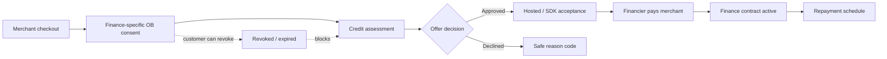
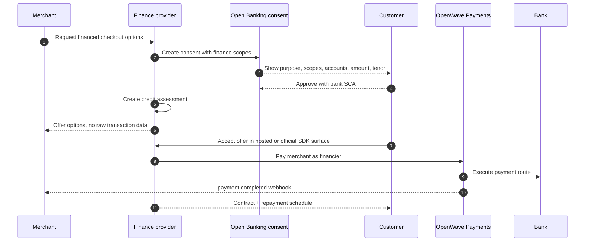

# Credit & Finance

Credit & Finance is the OpenWave module for financed payments. It connects customer-consented Open Banking data with product-specific offers and repayment lifecycles.

It is broader than a credit score. A lender may calculate a score, but OpenWave standardizes the consent, input package, assessment output, offer, contract, repayment schedule, and settlement events so banks, fintechs, merchants, and gateways can interoperate.

## One-minute mental model

Credit & Finance is a lifecycle module between Open Banking and Payments:

1. The customer grants a finance-specific Open Banking consent.
2. A provider creates a time-bound assessment from the consented data.
3. The provider creates a finance offer with clear terms.
4. The customer accepts inside a hosted or official SDK surface.
5. The financier pays the merchant through the normal OpenWave payment lifecycle.
6. Repayments are collected through mandates, scheduled payment orders, or manual payment.

## Who sees what

| Actor | Sees | Must not receive by default |
|---|---|---|
| Customer | Purpose, scopes, selected accounts, amount, tenor, offer, disclosures, repayment schedule, contract status. | Hidden finance terms or vague account-data access. |
| Merchant | Offer availability, merchant-safe status, final signed payment result, safe decline category where needed. | Raw transactions, salary payer names, full account history, internal bank facts. |
| Finance provider / lender | Consented assessment package, derived summaries, reason codes, decision audit, contract lifecycle. | Data beyond consent, expired-consent refresh, unrelated account data. |
| Bank / ASPSP | Consent request, selected accounts, SCA decision, data sharing audit, revocation. | Lender policy internals unless explicitly part of integration. |
| Gateway | Routing, consent orchestration, hosted acceptance, payment/webhook state. | Acting as lender of record unless separately licensed and configured. |

## Implementation path

| Phase | Build first | Production control |
|---|---|---|
| 1. Consent | Credit scopes and hosted finance consent screen. | Scope allowlist, consent expiry, revocation audit. |
| 2. Assessment | `POST /credit/assessments` with selected accounts and data window. | Provider plug-in, model metadata, safe reason codes. |
| 3. Offer | `POST /finance/offers` for BNPL, revolving credit, or Murabaha. | Versioned disclosures and customer-visible cost. |
| 4. Acceptance | Hosted or official SDK acceptance. | No merchant-owned OTP, PIN, or hidden terms. |
| 5. Settlement | Financier-to-merchant payment using OpenWave Payments. | Merchant fulfilment only after signed final payment event. |
| 6. Servicing | Contract and repayment schedule APIs. | Customer portal visibility, repayment webhooks, cancellation policy. |

## What belongs in this module

| Concern | Owner | Standardized by OpenWave |
|---|---|---|
| Customer account data access | Open Banking consent | Scopes, consent, selected accounts, expiry, revocation. |
| Affordability and risk package | Finance provider or lender | Assessment request/response shape, reason codes, audit fields. |
| Credit decision | Lender or finance provider | Decision lifecycle and safe decline output. Algorithm remains provider-specific. |
| Merchant payment | Payments API | Financier pays merchant using normal OpenWave payment settlement. |
| Customer repayment | Mandates or scheduled payment orders | Repayment schedule and payment events. |

## End-to-end financed checkout

## New Open Banking scopes

| Scope | Meaning |
|---|---|
| `credit_assessment:read` | Permit use of account data for a declared credit or finance assessment. |
| `income:read` | Permit derived income summaries. |
| `liabilities:read` | Permit derived recurring obligations and debt-service indicators. |
| `affordability:read` | Permit affordability output for the requested amount and tenor. |

The consent screen must say this is for credit or finance eligibility. Do not hide credit scopes inside generic account access.

## Supported finance purposes and products

| Purpose | Product type | Description |
|---|---|---|
| `BNPL` | `BNPL_INSTALLMENT` | Split a merchant checkout into scheduled repayments. |
| `REVOLVING_CREDIT` | `REVOLVING_CREDIT_DRAW` | Draw against an existing credit facility. |
| `MURABAHA_INSTALLMENT` | `MURABAHA_INSTALLMENT` | Islamic-finance asset-sale installment flow with disclosed cash price, profit, total sale price, and schedule. |

## Responsibility split

OpenWave defines the contract. It does not approve loans, set policy, certify a Sharia board, or become the lender of record.

The lender or finance provider owns:

- final credit decision and policy
- regulatory responsibility
- customer disclosures and contract documents
- Sharia governance where a product is presented as Islamic finance
- servicing, collections, restructuring, and dispute handling

OpenWave standardizes the data, consent, audit, and lifecycle so different implementations can speak the same language.

## Read next

- [Credit-assessment consent](./credit-assessment-consent.md)
- [BNPL flow](./bnpl.md)
- [Revolving credit flow](./revolving-credit.md)
- [Murabaha flow](./murabaha.md)
- [Financed-payment lifecycle](./financed-payment-lifecycle.md)
- [Risk, privacy, and explainability](./risk-privacy-explainability.md)
- [Credit & Finance API](../api/credit-finance.md)
