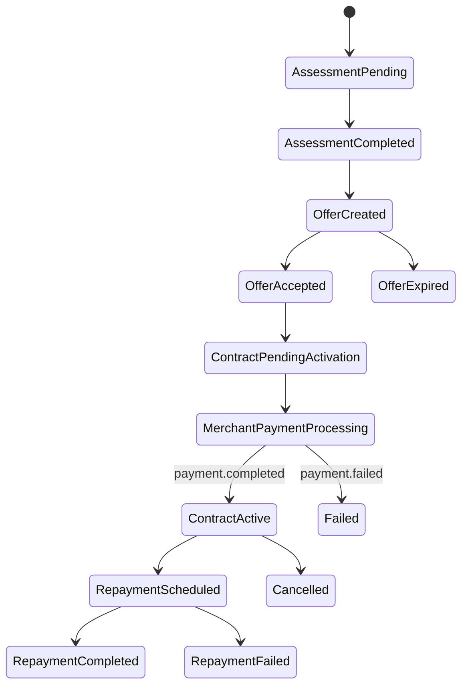
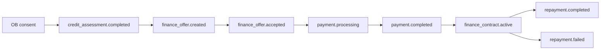

# Financed-Payment Lifecycle

Financed payments reuse the OpenWave payment and mandate rails after a finance offer is accepted. Credit & Finance is not a separate settlement rail.

## State relationship

## Status map

| Credit & Finance status | Payment rail status | Merchant action | Customer action |
|---|---|---|---|
| `ASSESSMENT_PENDING` | None | Wait. | Complete consent or SCA. |
| `ASSESSMENT_COMPLETED` | None | Do not fulfil. | Review available finance options. |
| `OFFER_CREATED` | None | Do not fulfil. | Review cost, schedule, and disclosures. |
| `OFFER_ACCEPTED` | `payment.processing` may start | Wait for final webhook. | Wait for payment confirmation. |
| `CONTRACT_PENDING_ACTIVATION` | `payment.processing` | Wait for final webhook. | No repayment due yet unless disclosed. |
| `CONTRACT_ACTIVE` | `payment.completed` | Fulfil order after verifying signature. | View contract and repayment schedule. |
| `FAILED` | `payment.failed` or rejected | Do not fulfil. | Choose another method or contact provider. |
| `CANCELLED` | Depends on timing | Follow cancellation and refund policy. | Confirm cancellation state. |

## Event and API relationship

## Merchant fulfilment

The merchant should not fulfil based on:

- consent created
- assessment completed
- offer created
- offer accepted without payment confirmation

The merchant fulfils after verifying final OpenWave payment confirmation, usually `payment.completed`.

## Repayment collection

Repayments should use one of the existing OpenWave mechanisms:

| Mechanism | Use |
|---|---|
| Mandate | Customer approves recurring collection for fixed or variable installment payments. |
| Scheduled payment order | Customer or provider creates scheduled PISP payments where supported. |
| Manual payment | Customer initiates each repayment manually when automation is not enabled. |

## Event order

Typical BNPL or Murabaha event order:

1. `credit_assessment.completed`
2. `finance_offer.created`
3. `finance_offer.accepted`
4. `payment.processing`
5. `payment.completed`
6. `finance_contract.active`
7. `repayment.completed` or `repayment.failed` per installment

If the merchant payment fails, the finance contract must not become active unless the product rules explicitly support later settlement and customer disclosure reflects that state.
