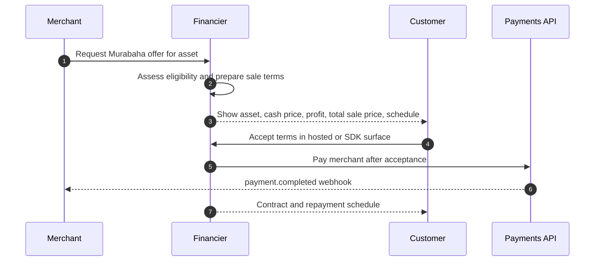
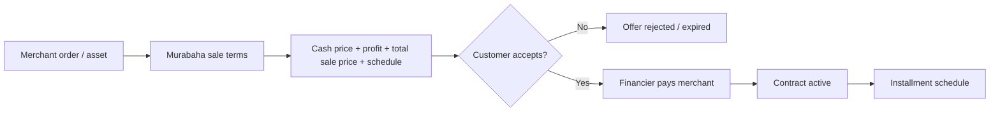

# Murabaha Flow

Murabaha installment finance is modeled as a financed checkout product with additional Islamic-finance disclosure fields. OpenWave standardizes the technical fields; Sharia governance remains with the lender, financier, or operator.

## Required Murabaha fields

| Field | Description |
|---|---|
| `asset_description` | Clear description of the goods or asset. |
| `cash_price` | Original cash price in minor units. |
| `profit_amount` | Disclosed profit in minor units. |
| `total_sale_price` | Cash price plus profit. |
| `down_payment` | Initial amount paid by customer, if any. |
| `installment_schedule` | Due dates and amounts. |
| `customer_acceptance_timestamp` | Time the customer accepted the sale terms. |
| `contract_disclosure_url` | Contract or disclosure document. |
| `sharia_profile_reference` | Optional product governance reference. |

## Flow

## Disclosure flow

Murabaha acceptance is not a generic "pay later" click. The customer must approve the sale terms before the financier pays the merchant.

## Example disclosure table

| Line item | Example |
|---|---|
| Asset | Smart Watch Pro and USB-C Hub 12-in-1 |
| Cash price | 860.000 LYD |
| Profit amount | 43.000 LYD |
| Total sale price | 903.000 LYD |
| Down payment | 0.000 LYD |
| Installments | 6 monthly payments of 150.500 LYD |
| Contract | Customer-readable disclosure URL before acceptance |

## Customer acceptance rule

The customer must see the cash price, profit amount, total sale price, repayment schedule, and contract/disclosure before acceptance. Acceptance must be timestamped and auditable.

## Merchant settlement

The financier pays the merchant through the normal OpenWave payment lifecycle. The merchant waits for final payment confirmation and does not need to know the customer’s assessment details.

## What v1 does not define

OpenWave v1 does not define Sharia board certification, asset ownership proof workflows, inventory custody, or dispute adjudication. Those remain outside the technical interoperability contract.
