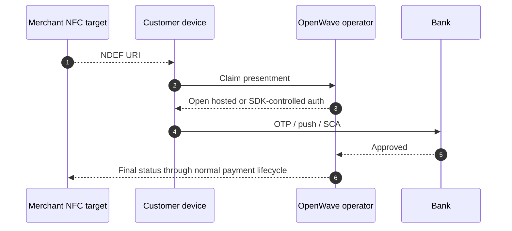

# NFC Handoff

OpenWave NFC uses the same conceptual model as QR: NFC starts a presentment claim, then hands the customer into a secure authorization flow.

## Why NFC exists in the standard

NFC gives the same trust model as QR but with a different user experience:

- no camera required
- better fit for in-person acceptance
- better fit for bank app or wallet tap flows

## v1 model

- Recommended payload: `NDEF_URI`
- URI value: signed OpenWave presentment URI
- Target uses: merchant-presented or customer-presented handoff

## Example NDEF payload

```json
{
  "format": "NDEF_URI",
  "value": "openwave://present/prs_01J15B6A1N2QZ5YP4V4P4FJW40?sig=abc123"
}
```

## Security expectations

- NFC tap alone is not payment authorization
- Replay protection still applies
- Device-local OTP or PIN collection outside the secure bank or hosted surface is out of scope
- Production deployments should bind NFC-presented flows to device and session telemetry where available

## Typical handoff sequence



## Typical NFC uses

| Use case | Pattern |
|---|---|
| Merchant countertop tap | `MERCHANT_PRESENTED` + `ONE_TIME_PAYMENT` |
| Subscription kiosk signup | `MERCHANT_PRESENTED` + `MANDATE_APPROVAL` |
| Wallet tap-to-pay start | `CUSTOMER_PRESENTED` + `ONE_TIME_PAYMENT` |

## Bank interoperability rule

If banks claim NFC support, they should all:

- accept the same OpenWave URI model
- publish capability flags honestly
- keep customer approval inside a trusted bank-controlled surface
- map the result back into normal OpenWave payment or mandate statuses
