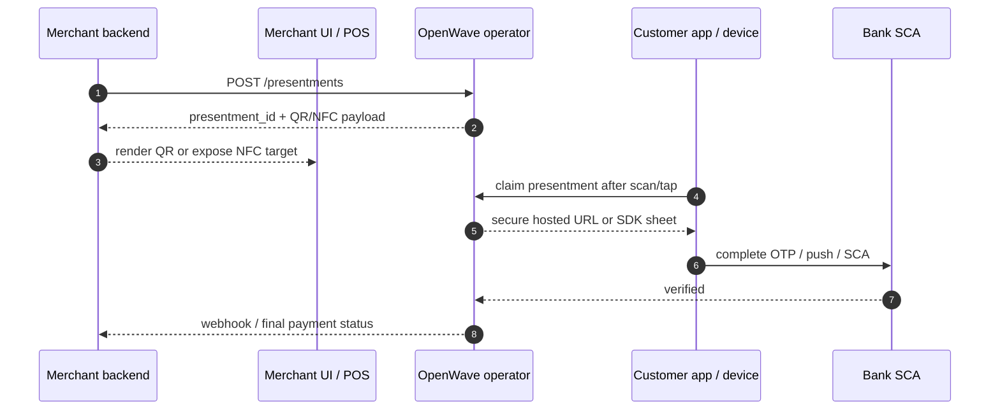
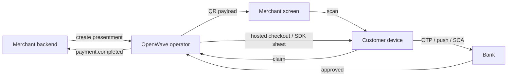

# Presented Payments

Presented payments add **scan** and **tap** as payment-entry channels without weakening the existing OpenWave trust model.

## In one sentence

**QR or NFC starts the payment. OpenWave still controls the secure authorization and final payment lifecycle.**

## What changes

Instead of the customer always starting from a hosted checkout URL, the flow may start from:

- a merchant-displayed QR code
- an NFC tap target
- a customer-presented QR or NFC token shown from a wallet or bank app

## What does not change

- The customer still authorizes inside a trusted hosted or bank-controlled surface.
- Merchants still never handle OTPs, push-approval decisions, or bank credentials.
- Final one-time payment and recurring mandate outcomes still reuse the normal payment and mandate lifecycle.

## Actor model

| Actor | Role in presented payments | Must not do |
|---|---|---|
| Merchant | Shows QR, exposes NFC target, receives final status | Collect bank OTP, PIN, or push approval result |
| Customer | Scans, taps, or presents token | Bypass secure authorization |
| Gateway / bank / wallet operator | Creates or claims presentment, enforces policy, opens secure flow | Treat QR or NFC alone as final authorization |
| Bank | Performs SCA and money movement | Let merchant UI impersonate bank authorization |
| Identity registry | Resolves alias or NPT when needed | Own presentment, payment session, or consent lifecycle |

## Supported v1 modes

| Mode | Intent | Description |
|---|---|---|
| `MERCHANT_PRESENTED` | `ONE_TIME_PAYMENT` | Merchant shows QR or NFC for immediate checkout. |
| `CUSTOMER_PRESENTED` | `ONE_TIME_PAYMENT` | Customer wallet or bank app shows a token for merchant acceptance. |
| `MERCHANT_PRESENTED` | `MANDATE_APPROVAL` | Merchant starts a recurring mandate approval flow from QR or NFC. |

## What OpenWave standardizes

OpenWave standardizes:

- the presentment object
- the QR and NFC payload model
- capability discovery
- claim and cancellation behavior
- the security boundary between merchant UI and authorization UI

OpenWave does **not** force one operator model. The same channel can be implemented by:

- a gateway such as Neptune. Astro
- a bank directly
- a wallet or payment app directly

## Operator-controlled channel enablement

Presented payments are part of the standard, but **not every deployment must enable every mode**.

Operators may independently enable or disable:

- QR
- NFC
- merchant-presented
- customer-presented
- one-time presented payments
- recurring mandate-presented approvals
- direct-bank implementation
- direct-wallet implementation

Availability must be exposed through the capability metadata so merchant, wallet, and bank software can adapt at runtime.

## Simple end-to-end flow

## Security boundaries

| Actor | Allowed | Not allowed |
|---|---|---|
| Merchant UI | Show QR, expose NFC target, receive final status | Collect OTP or bank secrets |
| Wallet / bank app | Scan or tap, claim presentment, continue in secure app flow | Skip SCA when the payment or mandate requires it |
| Gateway / bank / wallet operator | Create presentment, enforce expiry and replay protection, route lifecycle | Treat QR alone as final authorization |

## Relationship to existing payment rails

Presented payments are a **channel layer**.

That means:

- QR does not create a new settlement rail
- NFC does not create a new settlement rail
- customer-presented tokens do not create a new settlement rail

After claim, the operator reuses the normal:

- payment session lifecycle
- recurring mandate approval lifecycle
- settlement routing
- webhook events

## Typical flows

### Merchant-presented one-time payment

1. Merchant backend creates a presentment.
2. Merchant site or POS displays QR or NFC.
3. Customer scans or taps.
4. Customer lands in hosted or app-controlled secure authorization.
5. Presentment becomes a normal payment session.
6. Final merchant fulfilment still depends on webhook or final payment status.

### Merchant-presented recurring approval

1. Merchant backend creates a presentment with `intent = MANDATE_APPROVAL`.
2. Customer scans or taps.
3. Customer sees mandate amount, frequency, duration, and merchant name.
4. Customer approves through bank OTP or push.
5. Presentment becomes a normal mandate approval flow.

### Customer-presented token

1. Customer wallet or bank app generates a customer-presented token.
2. Merchant scanner or POS claims it.
3. Operator creates the underlying payment session.
4. Customer completes any required authorization in the secure app surface.

## Interoperability rules for banks

To keep every bank interoperable, banks should all follow the same minimum behavior:

| Topic | Required common behavior |
|---|---|
| QR parsing | Accept the OpenWave URI or signed presentment reference format |
| NFC parsing | Accept the OpenWave NDEF URI format |
| Capabilities | Publish enabled channels, modes, and intents accurately |
| SCA | Perform OTP, push, or bank-controlled approval in a trusted surface |
| Status | Map presentment outcomes into standard payment or mandate states |
| Errors | Return retry-safe error envelopes with correlation IDs |

## What a customer should always see

For one-time payments:

- merchant name
- amount and currency
- destination context
- bank account or alias being used, masked as needed

For recurring mandate approval:

- merchant name
- recurring amount or max amount
- frequency
- expiry / duration
- cancellation rights
- bank account or alias being used, masked as needed

## Read next

- [QR payloads](./presented-qr.md)
- [NFC handoff](./presented-nfc.md)
- [Direct bank and wallet implementation](./presented-direct.md)
- [Channel governance](./presented-governance.md)
