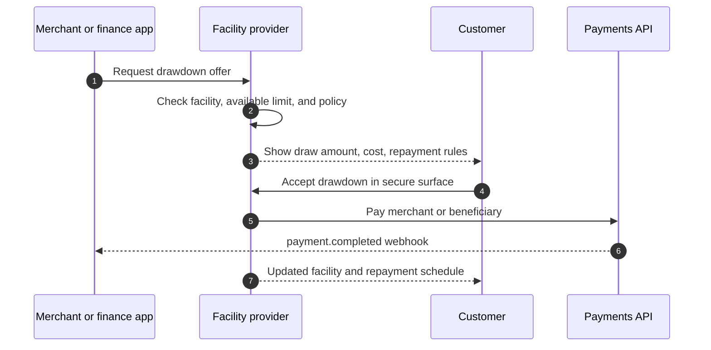
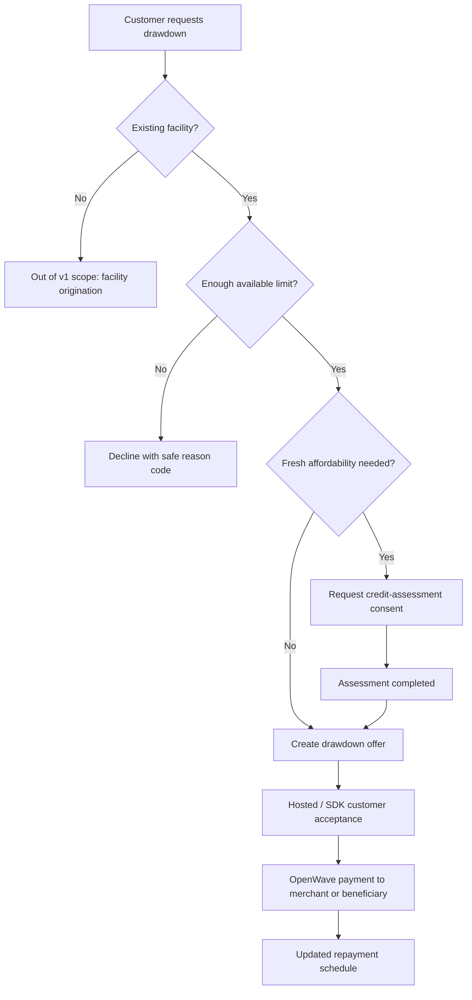

# Revolving Credit Flow

Revolving credit in OpenWave covers a drawdown from an existing approved facility. It is not a new facility-origination standard in v1.

## When to use it

Use `REVOLVING_CREDIT_DRAW` when:

- the customer already has an approved credit facility
- the provider can confirm available limit
- the customer is drawing a specific amount for a purchase or transfer
- repayment terms are disclosed before acceptance

## Flow

## Drawdown decision path

## Boundary with facility origination

| In v1 | Outside v1 |
|---|---|
| Confirm an existing facility and available limit. | Originate a brand-new credit facility from scratch. |
| Create a drawdown offer. | Define lender underwriting policy. |
| Show cost, repayment rules, and facility impact. | Replace regulated lending disclosures. |
| Settle the drawdown through OpenWave Payments. | Become a separate settlement rail. |

## Required fields

| Field | Description |
|---|---|
| `product_type` | `REVOLVING_CREDIT_DRAW` |
| `facility_id` | Existing facility reference. |
| `amount` | Draw amount in minor units. |
| `finance_cost` | Interest, fees, total payable where determinable. |
| `repayment_schedule_preview` | Minimum payment schedule or fixed drawdown schedule. |

## Consent needs

A fresh Open Banking assessment may be optional if the lender already owns the facility and policy allows facility-only drawdown. If fresh affordability is required, use the same credit-assessment consent flow as BNPL.

## Settlement

The accepted drawdown still settles through the Payments API. The merchant or beneficiary should trust the same final payment states and webhook signatures used by regular OpenWave payments.
