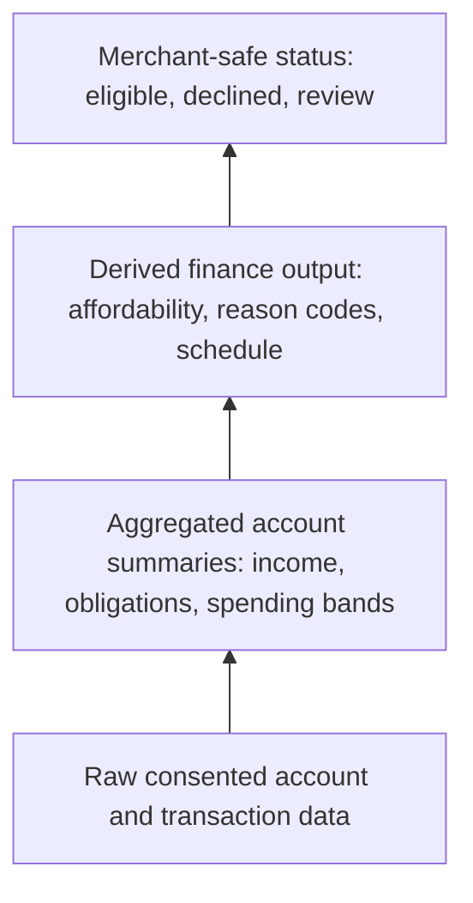
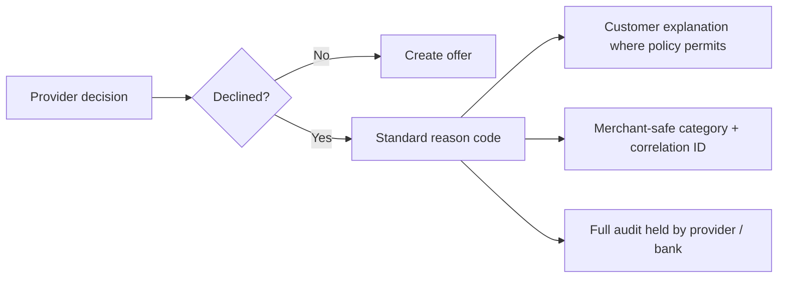

# Risk, Privacy, and Explainability

Credit & Finance data is sensitive. The standard must help providers make explainable decisions without leaking raw customer banking facts to merchants or unrelated systems.

## Standard principles

| Principle | Requirement |
|---|---|
| Purpose-bound | Assessment output is tied to purpose, amount, tenor, customer, and consent. |
| Time-bound | Assessments expire and cannot be reused indefinitely. |
| Data minimization | Share derived summaries when raw transaction data is not needed. |
| Explainability | Return safe reason codes and model metadata. |
| Auditability | Every assessment, offer, acceptance, and contract change has a correlation ID. |
| Revocability | Revoked consent blocks refresh and future use. |

## Data minimization ladder

Use the lowest data level that can support the decision and customer explanation.



| Level | Typical recipient | Rule |
|---|---|---|
| Merchant-safe status | Merchant | Default maximum sharing level. |
| Derived finance output | Finance provider, customer | Must be tied to consent, purpose, amount, and tenor. |
| Aggregated summaries | Finance provider or lender | Prefer summaries over raw lines. |
| Raw consented data | Bank, ASPSP, explicitly authorized provider | Never expose to merchant by default. |

## Provider-owned scoring

OpenWave does not force one scoring model. Providers may return an optional `risk_score`, but must include model metadata:

```json
{
  "score": 692,
  "scale_min": 300,
  "scale_max": 900,
  "band": "MEDIUM_LOW_RISK",
  "model_id": "provider-model-v1",
  "model_version": "2026-05"
}
```

This makes the output interoperable while keeping policy and model ownership with the provider.

## Reason codes

Reason codes should be safe enough for customer support and merchant operations:

| Code | Category | Notes |
|---|---|---|
| `STABLE_INCOME` | Positive | Recurring income pattern detected. |
| `INSUFFICIENT_INCOME_HISTORY` | Negative | Not enough data to verify income stability. |
| `HIGH_OBLIGATION_RATIO` | Negative | Existing and proposed obligations exceed policy. |
| `RECENT_RETURNED_PAYMENTS` | Negative | Returned or failed payment pattern found. |
| `HIGH_VOLATILITY` | Review | Cashflow is volatile and needs additional review. |
| `REQUESTED_AMOUNT_TOO_HIGH` | Negative | Amount exceeds eligible range. |
| `TENOR_OUTSIDE_POLICY` | Negative | Requested tenor is not supported. |
| `MANUAL_REVIEW_REQUIRED` | Review | Human review needed before offer. |

Do not return raw salary payer names, full transaction descriptions, counterparty names, national identifiers, or account numbers in merchant-facing decline payloads.

## Decline handling



## Audit fields

At minimum, store:

- consent ID
- selected accounts
- requested amount and currency
- purpose and product type
- data window
- assessment model metadata
- reason codes
- offer version and disclosure URL
- customer acceptance timestamp
- repayment schedule version
- correlation ID

## Customer rights

Customers should be able to:

- see what consent was granted
- see what assessment purpose was used
- revoke consent
- view active finance contracts
- view repayment schedules
- receive clear decline or review status where policy permits
